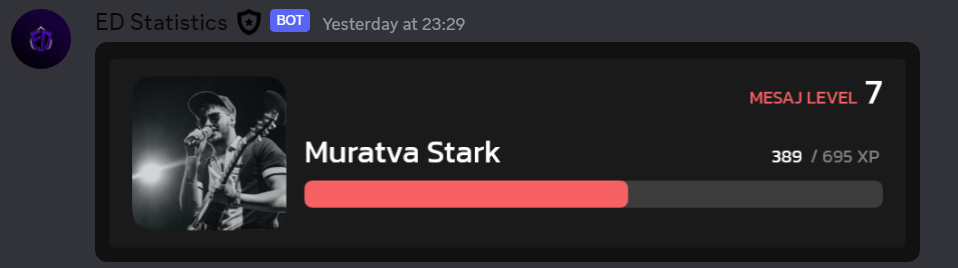
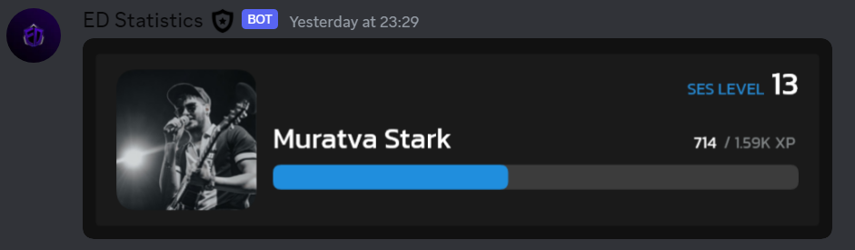
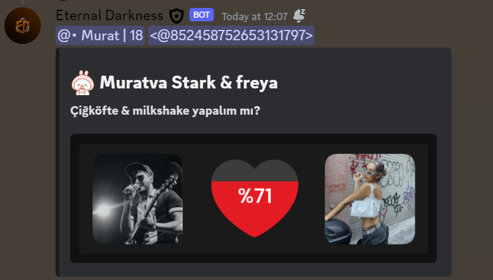
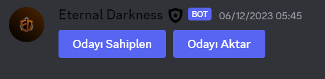

## [VERSION 1]([https://github.com/muratva-bots](https://github.com/orgs/muratva-bots/repositories))

## ⭐️ Show your support

Give a star if this project helped you!

## 🍭 Images From Bot

| Top Command (General)                            | Point Command                                  | Stat Command                                    | Take Task Command (No Take)                  |
| ------------------------------------------------ | ---------------------------------------------- | ----------------------------------------------- | -------------------------------------------- |
|    |        |          |  |
| Take Task Command (Taked)                        | Task Command                                   | Top Command (Spesific)                          | Weekly Stat Command                          |
|     |         |  |     |
| Message Level Command                            | Voice Level Command                            | Ship                                            | Streamer Menu                                |
|  |  |          |      |

## 🐻‍❄️ Author & Lisence

Copyright © 2023 [Muratva Stark](https://github.com/muratvastark). This project is [Apache 2.0](https://github.com/muratvastark/eternal-darkness/blob/main/LICENSE) licensed.
