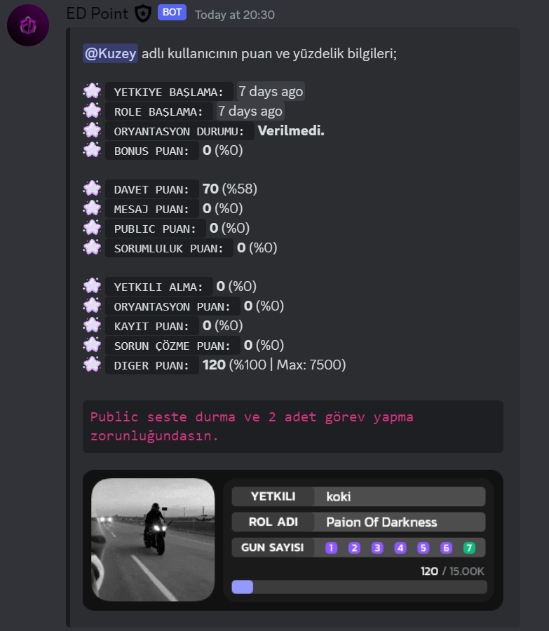
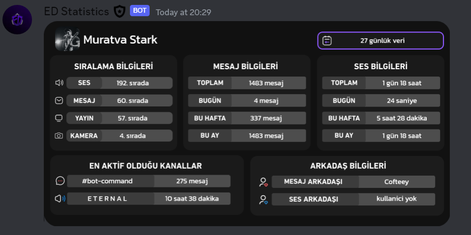
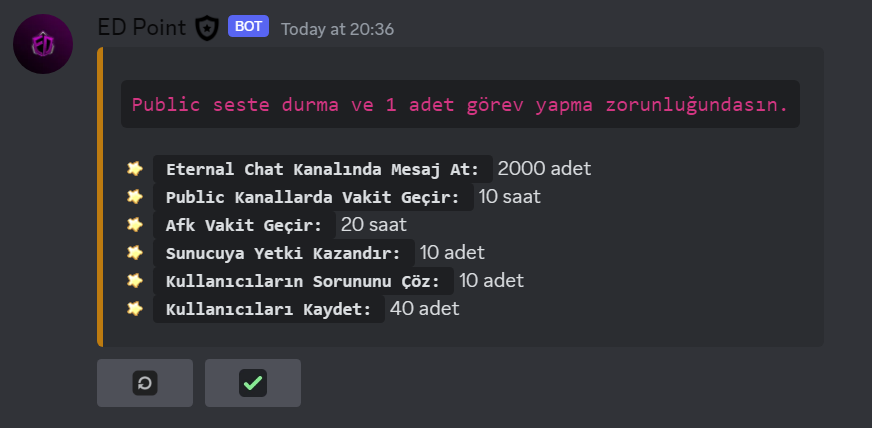
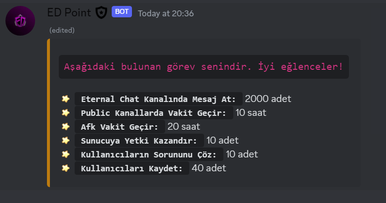
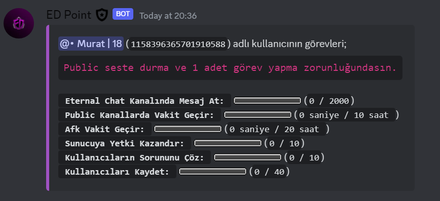
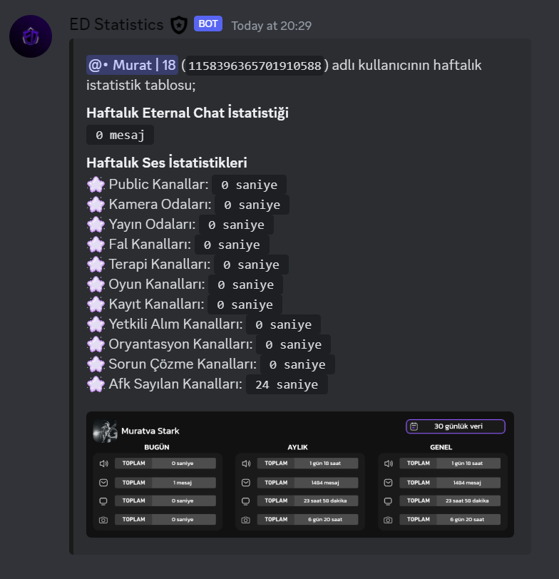

# 🍭 EXAMPLES

    
    
    
    
    
    
    
    

## Author

👤 **Muratva Stark**

- Discord: [Muratva Stark](https://discord.com/users/1158396365701910588)
- Github: [@muratvastark](https://github.com/muratvastark)

## 🤝 Contributing

Contributions, issues and feature requests are welcome! Feel free to check [issues page](https://github.com/muratvastark/eternal-darkness/issues).

## Show your support

Give a ⭐️ if this project helped you!

## 📝 License

Copyright © 2023 [Muratva Stark](https://github.com/muratvastark). 
This project is [Apache 2.0](https://github.com/muratvastark/eternal-darkness/blob/main/LICENSE) licensed.
